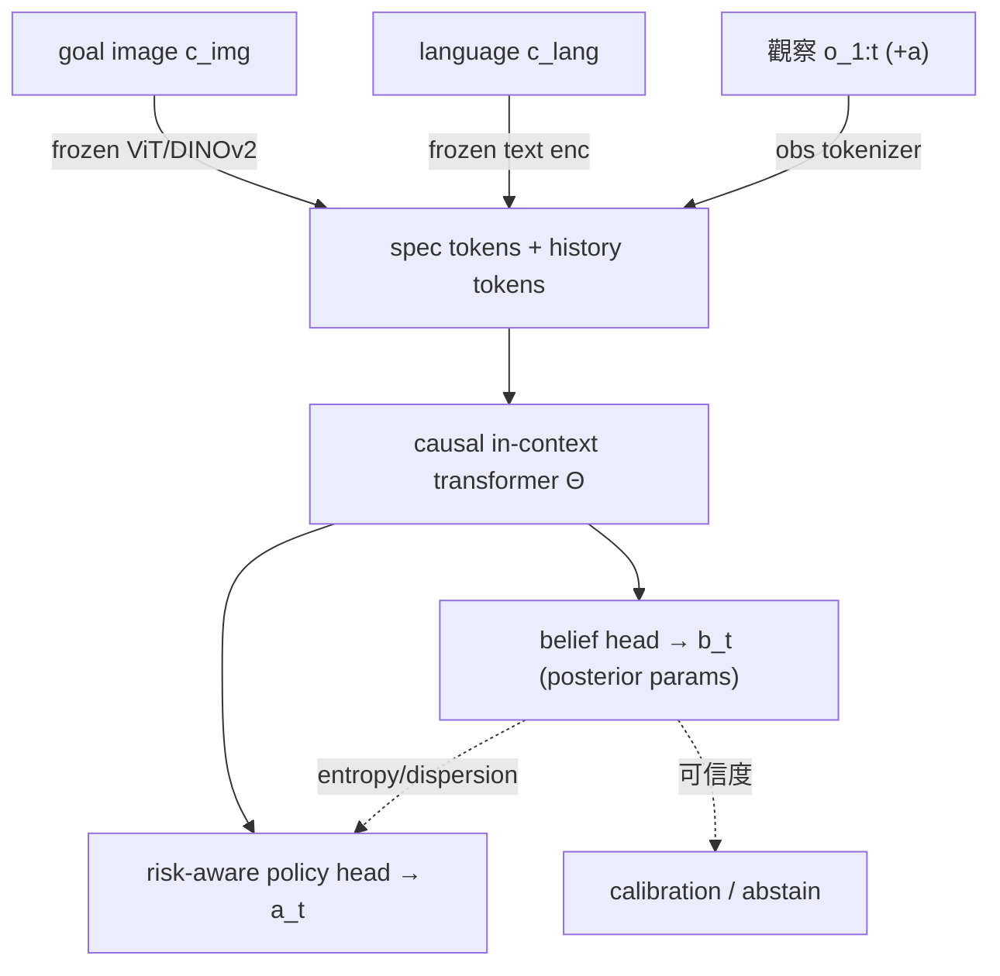

# 完整方法：Belief-from-Specification（暫名 BTS）

> 上游：[[zero_shot_proposal|zero-shot 創新提案]]｜[[related_work_checklist|related work 查證]]｜[[研究主線地圖]]
> 暫定工作名稱：**BTS — Belief-from-Specification for Zero-Shot Meta-RL**（投稿時再換更響亮的名）
> 狀態：完整方法草案（v1）。技術底座採 **in-context RL（DPT/AD 路線）為主**，VariBAD-style 當理論動機與簡化 baseline。

---

## 0. 一句話與核心主張

> **meta-RL 已經有一套成熟的「task-belief 推論」機器，但它一直被綁在「測試時要先跟新任務互動」的前提下。我們把這套推論機器解放出來——讓「免互動的多模態任務規格（語言+圖）」直接成為 belief 的來源，於是同時拿到 zero-shot 的免互動、與 meta-RL 的不確定性感知與可持續精修。規格模糊時 belief 變寬、agent 自動 risk-aware；拿到觀察時 belief 在 inference-time 前向收斂，全程不更新權重。**

---

## 1. Motivation：為什麼 meta-RL × zero-shot 是還沒被吃乾的金礦

### 1.1 一個結構性落差

- **meta-RL 的本質**就是「在一個任務分布 `p(M)` 上學會推論任務」——它的整套機器（task latent、posterior belief、context inference）天生為「面對沒見過的新任務，快速搞懂它是什麼」而設計。
- 但傳統 meta-RL（[[PEARL]]、[[VariBAD]]）**用「互動」搞懂任務**：測試時要先收集 context / rollout 幾步。
- **zero-shot 的精神**是「連互動都不給，光靠一個規格就要懂」。
- 中間這道縫 = meta-RL 有精緻的 belief 推論機器，卻被綁在「要先互動」；zero-shot 想免互動，卻多半用粗方法（[[T2DA]] 直接 CLIP 對齊**一個點**）。

**我們的洞見：把 meta-RL 的 belief 推論機器，接到 zero-shot 的「免互動規格」上——規格直接當 belief 的起點，需要時才用觀察精修。**

### 1.2 meta-RL 給 zero-shot 帶來三個別人給不了的東西

1. **不確定性是內建的，不是外掛的。** belief 天生是分布，「我有多確定任務是什麼」免費附帶。一般 zero-shot 分類器要硬加 uncertainty head；meta-RL 本來就有。
2. **「邊做邊修正」是內建的。** 「看到新證據→更新 belief」是同一套機器，所以從「純 zero-shot（只有規格）」平滑過渡到「few-shot（規格+幾步觀察）」不用換方法。[[T2DA]] 對齊一個點後就定死，做不到。
3. **任務分布的結構可被利用。** 在「整個任務分布」上訓練，學到任務之間的關係，面對新規格能「在學過的任務空間裡定位」而非從零猜。

### 1.3 三條路的定位（最強 framing）

> 面對模糊的任務規格，現有方法二選一：要嘛**問人澄清**（[[related_work_checklist|KnowNo/RCIP]]），要嘛**假裝無歧義直接執行**（[[T2DA]]/[[LUMOS]]/MUTEX/VIMA）。我們提出第三條路：把規格映成 **task 後驗信念**，agent **自主**用觀察 inference-time 收斂、做 risk-aware 行為——免人介入、免重訓。

---

## 2. Problem Statement（正式問題設定）

### 2.1 任務分布與規格

- 任務分布 `M ~ p(M)`，每個任務有隱 task 變數 `z*`（決定 reward / goal / 必要時 dynamics）。
- 每個任務配一組**規格** `c = (c_img, c_lang)`：goal image、language instruction，或兩者（任一可缺）。
- **規格是歧義的**：真實對應關係 `p(z* | c)` 不是 delta，而是一個分布（一句模糊話 / 一張未言明細節的圖，對應多個合理任務）。

### 2.2 三個泛化軸（明確定義，避免 reviewer 模糊攻擊）

1. **Unseen instruction / spec**：看過的任務、沒看過的規格講法或新 goal image。
2. **Unseen task（組合）**：訓練中各因素見過，但其組合沒見過（CALVIN 的組合結構天然支援）。
3. **Unseen environment**：CALVIN 的 ABC→D（沒看過的場景）。

### 2.3 嚴格 zero-shot 定義（守住，寫進論文）

測試任務：**無 target demonstration、無梯度更新、無針對新任務的額外訓練**。唯一允許：給規格 `c` + 測試時環境觀察 `o_{1:t}` 做**前向** belief 更新。這保證「zero-shot（t=0，只有規格）」與「few-shot（t>0，規格+觀察）」是同一條曲線的兩端。

### 2.4 目標

學一個系統，給歧義規格 `c`，輸出：
- **task 後驗信念** `b_t = b(z | c, o_{1:t})`（分布，非點）；
- **risk-aware 行為** `a_t ~ π(a | s_t, b_t)`，在 `b_t` 寬時偏好 information-gathering / 保險動作，`b_t` 收斂後果斷執行；
- **可信度訊號**（belief 的 entropy / dispersion），可用於 calibration 與 abstain。

主要指標：unseen 規格下的 zero-shot 成功率（t=0）+ belief 隨觀察收斂後的成功率曲線（t>0）+ 可信度校準。

---

## 3. 方法架構（in-context RL 為主）

四個元件,逐一說明。

### 3.1 多模態規格編碼（Spec Encoder）

- **圖**：凍結的視覺 encoder（DINOv2 / ViT / CLIP-visual）出 patch tokens。
- **語言**：凍結的 text encoder（CLIP-text / T5 / MiniLM）出 token。
- 各自過一層輕量 projection 投到共同 token 空間，標上 modality embedding 與 "spec" segment embedding。
- **缺模態**：用可學的 null token 取代（讓模型學「只有圖 / 只有語言 / 兩者」三種情況）。

### 3.2 In-Context 任務推論（核心 transformer Θ）

- 輸入序列 = `[spec tokens] ++ [(o_1,a_1), (o_2,a_2), …, (o_t, ·)]`，causal mask。
- transformer Θ 在 context 裡同時做兩件事：推論任務、產生行為。**這就是把 meta-RL 的 belief 推論搬進 in-context**——DPT 已證明這種 supervised-pretrained transformer 在 context 中近似 posterior sampling / Thompson sampling（理論靠山）。
- t=0 時 context 只有 spec → belief 純由規格決定（= zero-shot 起點）。t 增加 → 觀察進 context → belief 收斂（= 免梯度的 inference-time refinement）。

### 3.3 顯式 Belief Head（本研究的關鍵新增，DPT/SPICE 沒有的）

DPT 的 posterior 是**隱式**的（藏在 attention）。我們**顯式化**:讓一個 belief head 從 Θ 的表徵輸出 belief 的參數,有三種可選實作（ablation 比較）:

- **(a) 類別後驗**:對一組學到的 task prototype `{z_1,…,z_K}` 輸出機率 `b_t = softmax(...)`。entropy 直接可算。最簡單、最好解釋,**建議當主版本**。
- **(b) 高斯後驗**:輸出 `(μ_t, Σ_t)`,連續 task latent。
- **(c) Ensemble / particle**:輸出多個 task latent 樣本,用 dispersion 當不確定性,最能表達**多峰歧義**（一個規格對應好幾個分得很開的任務）。

「規格越模糊 → belief 越寬」這件事不是靠手寫,而是靠 §4 的訓練資料逼出來。

### 3.4 Risk-Aware Policy Head

- policy head 吃 `(s_t, b_t)`——**吃整個 belief（分布的參數或多個樣本）**,不是吃單一 sample。
- risk-aware 機制（兩個層次,可都做）:
  - **行為層**:belief 寬時,policy 傾向選「對 belief 下多個高機率任務都不差」的動作（min over tasks / CVaR over belief),或 information-gathering 動作（能讓下一步觀察最大幅收斂 belief 的動作）。
  - **訓練層**:用 belief 加權的 risk 目標（見 §4.3）。

---

## 4. 訓練（如何在離線多任務資料上學出上面這些）

整體是 **supervised in-context pretraining**（DPT 式）+ 三個額外目標。資料：CALVIN 的多任務 play（每任務可程序化偵測 + 規格）。

### 4.1 怎麼「製造歧義」——這是全論文最關鍵的設計

歧義不能憑空,要在訓練資料裡造出「**一個規格 → 多個合理任務**」的對應,模型才學得會「模糊→寬 belief」。三種互補做法:

1. **語言抽象化**:把精確指令換成上位詞 / 省略修飾。"push the **red** block left" → "push **a** block left"（對應 red/blue/pink 三個任務）。CALVIN 有 11 種同義講法 + 物件顏色,天然好造。
2. **圖片欠規格**:goal image 只渲染「任務相關的子集」或刻意保留多種解讀(同一張「方塊靠左」的圖,可由 push 或 rotate 達成)。
3. **跨模態歧義度不對稱**:有時語言精確、圖模糊;有時相反。逼模型學「**依模態歧義度動態融合**」(§3 的 null/modality token 支援這件事)。

每個歧義規格 `c` 配一個 **ground-truth 任務集合** `Z(c) = {z*_1, …, z*_m}`(用 CALVIN 的 task detector 自動標出「這個規格在資料裡實際對應到哪些任務」)。這個 `Z(c)` 是 belief 監督的目標。

### 4.2 In-Context 行為 pretraining loss（主 loss）

DPT 式:給 `[spec, history_{<t}]`,監督預測「對的 action」(來自能解 `Z(c)` 中任務的專家/relabel 軌跡)。

\[
\mathcal{L}_{\text{IC}} = \mathbb{E}_{c,\,z^*\sim Z(c),\,\tau\sim D_{z^*}}\Big[\sum_t -\log \pi_\Theta\big(a_t \mid s_t,\, c,\, o_{1:t-1}\big)\Big]
\]

關鍵:**同一個 `c` 在不同訓練樣本裡會配到 `Z(c)` 中不同的 `z*`**——這逼 transformer 在「只有 spec、還沒觀察」時保持對多個任務的不確定(寬 belief),拿到觀察後才往其中一個收斂。**歧義 → 寬 belief 是這樣自然長出來的,不是手寫的。**

### 4.3 Belief 監督 loss（讓 belief head 對齊真實歧義）

讓顯式 belief `b_t` 對齊「在當前 context 下,規格仍相容的任務集合」。t=0 時應覆蓋整個 `Z(c)`;t 增加時隨觀察排除掉不相容任務。

\[
\mathcal{L}_{\text{belief}} = \mathbb{E}\Big[\sum_t \mathrm{KL}\big(\,b_t \,\|\, p^*(z \mid c, o_{1:t})\,\big)\Big]
\]

其中 `p*(z | c, o_{1:t})` 是用 CALVIN task detector 算出的「**oracle 相容任務分布**」(在 `Z(c)` 上、排除已被觀察否證的任務後 normalize)。這是一個乾淨的、可自動算的監督訊號——CALVIN 能對任意 frame 判定任務狀態,所以這個 oracle 後驗算得出來。

### 4.4 Risk-aware / 校準 loss

- **risk 目標**:對 belief 下的任務取 CVaR 或 min,讓 policy 對「belief 中最可能但最難的任務」也不差:
\[
\mathcal{L}_{\text{risk}} = \mathbb{E}\big[\,\mathrm{CVaR}_{\alpha}\,_{z\sim b_t}\, \ell(\pi_\Theta, z)\,\big]
\]
- **calibration 目標**:用 proper scoring rule(如 belief 的 NLL / Brier)讓「belief entropy」真的反映「成功機率」,使可信度可用於 abstain。

### 4.5 總目標

\[
\mathcal{L} = \mathcal{L}_{\text{IC}} + \lambda_1 \mathcal{L}_{\text{belief}} + \lambda_2 \mathcal{L}_{\text{risk}} + \lambda_3 \mathcal{L}_{\text{cal}}
\]

訓練全程**離線**(只用 CALVIN play + 程序化標的 `Z(c)` 與 oracle 後驗);測試全程**前向**(無梯度)。

---

## 5. 測試流程（嚴格 zero-shot）

1. 給 unseen 規格 `c`(新講法 / 新 goal image / 新組合)。
2. t=0:Θ 從 spec tokens 出初始 belief `b_0`(模糊規格 → 寬)。risk-aware policy 出第一個動作(寬 belief → 偏保險 / info-gathering)。
3. t>0:把觀察 `o_t` 加進 context → Θ 前向 → belief 收斂 `b_t` → 行為漸果斷。**全程不更新權重。**
4. 任何時刻可讀 `b_t` 的 entropy 當可信度:過閾值可 abstain(交人 / 停手)。

---

## 6. 實驗設計

### 6.1 平台與設定
- **主平台**:[[CALVIN]](天然 play + 圖/語言雙規格 + 嚴格 zero-shot + task detector 可算 oracle 後驗)。
- **規格**:goal image / language / 兩者,各自含「精確」與「歧義」兩版。
- 泛化軸:unseen instruction、unseen task(組合)、ABC→D unseen env。

### 6.2 三組核心實驗(對應三個賣點)
1. **歧義規格下的 zero-shot**:vs [[T2DA]]、[[LUMOS]]、MCIL/HULC、DPT-baseline。看「規格刻意模糊」時 belief + risk-aware 是否勝出。
2. **多模態歧義融合**:image-only / language-only / 歧義感知融合三者比較,證明「依歧義度融合」有效。
3. **可信度校準 + abstain**:belief entropy vs 實際成功率的 calibration plot;OOD 規格能否 abstain。

### 6.3 關鍵 ablation
- **belief vs 單點**(拔掉分布 → 退化成 [[T2DA]] 式):核心對照,證明 belief 有用。
- **有無 inference-time 觀察更新**(t=0 凍 belief vs 持續收斂):證明「邊做邊修」有用。
- **有無 risk-aware**(拔掉 → 盲目執行 belief mean / argmax)。
- **belief head 三選一**(類別 / 高斯 / ensemble),看哪個最能處理多峰歧義。
- **底座對照**:in-context(主) vs VariBAD-style(簡化) vs diffusion belief(表達力)。

### 6.4 指標
- zero-shot 成功率(t=0)、收斂曲線(成功率 vs t)、calibration(ECE / reliability diagram)、abstain 的 precision-recall。

---

## 7. 與最近鄰的逐點防守（reviewer 一定問）

| 近鄰 | 它做了什麼 | 我們的關鍵差異 |
| --- | --- | --- |
| **[[T2DA]]** | language→單一 decision embedding→zero-shot;abstract 提 task belief | 我們是**分布 belief**(非單點)、**多模態+歧義規格**、**顯式 uncertainty 驅動 risk-aware 行為**、**inference-time 收斂** |
| **SPICE**(ICLR26) | Bayesian fusion of context + value prior, posterior UCB, risk-aware ICRL | SPICE 融合「context+value prior」於純 RL/bandit;我們融合「**多模態歧義規格(prior)+觀察(likelihood)**」於 robot manipulation,且規格本身歧義、跨模態歧義度不同 |
| **[[LUMOS]]** | language-conditioned world-model IL + CALVIN/真機 zero-shot | LUMOS 確定式、無 belief、無歧義建模;我們是 ambiguous spec → explicit posterior → risk-aware |
| **KnowNo / RCIP** | 歧義 → uncertainty → **問人澄清** | 我們**免人介入**:belief + 自主 info-gathering 收斂 |
| **VIMA / MUTEX** | 多模態 spec → 確定式 unified policy | 他們把多模態當「可互換等價 spec」;我們把**模態歧義度當 belief 寬度來源** |
| **DPT / AD** | in-context RL,隱式 posterior | 我們**顯式化** belief、接**多模態歧義規格**、加 **risk-aware + calibration** |

**核心防守句**:我們不是「meta-RL 加語言」,也不是「zero-shot 加 uncertainty」;我們改變了問題定義——**從「規格→一個任務」變成「歧義多模態規格→task 後驗信念」**,並用「規格當 prior、觀察當 likelihood 的免梯度 in-context Bayesian 收斂」把 meta-RL 的 belief 推論第一次解放到「免互動規格」場景。

---

## 8. Proof-of-Concept（最小可跑版本,先驗證再擴大）

**目標**:用最小成本證明「歧義 → 寬 belief → risk-aware → 收斂」這條鏈會動。

- **環境**:先用 CALVIN 單環境(D)或更小的 2D/格子版,只取少數任務(如 push red/blue/pink + open drawer)。
- **規格**:只做**語言歧義**(精確 "push red" vs 歧義 "push a block"),圖片與多模態先放後面。
- **底座**:先用最快出結果者——VariBAD-style 或小 transformer DPT。
- **要看到的現象**:(1) 給歧義語言時 belief entropy 明顯高於精確語言;(2) 隨觀察進來 entropy 下降、成功率上升;(3) risk-aware 版在歧義規格下勝過「單點 argmax」版。
- 這三個現象成立 → 核心假設驗證 → 再擴到圖片、多模態、ABC→D、完整 baseline。

---

## 9. 風險與對策

| 風險 | 對策 |
| --- | --- |
| belief 學不出「模糊→寬」(直接 collapse 成單點) | §4.1 的「同 c 配多 z*」是關鍵;加 §4.3 belief KL 監督;用 ensemble head 抗 collapse |
| oracle 後驗 `p*` 不好算 | CALVIN task detector 可對任意 frame 判定任務,理論上算得出;先在小任務集驗證 |
| risk-aware 反而保守到不動 | CVaR 的 α 當旋鈕做 ablation;info-gathering 要有「值得探索才探索」的 budget |
| 與 SPICE 太像 | 鎖死在「多模態歧義 robot spec」這個 SPICE 沒碰的場景,且我們有顯式 belief 監督 + calibration |
| 算力 | PoC 先小;in-context transformer 比跑真 RL 省(離線監督式) |

---

## 10. 時程建議（投稿導向）

1. **第 1 階段（PoC）**:語言歧義 + 小任務集 + 簡化底座,驗證三現象(§8)。
2. **第 2 階段（主結果）**:擴到圖片 + 多模態 + in-context 底座 + 完整 baseline(T2DA/LUMOS/DPT/MCIL)。
3. **第 3 階段（賣點補強）**:calibration / abstain 實驗、ABC→D、ablation 全套。
4. **投稿前**:related work 再 sweep 一次(防 2026 新投稿);補 SPICE/T2DA 逐點對比表。

---

## 11. 一句話總結

把 meta-RL 成熟的 task-belief 推論機器,從「測試要先互動」解放成「免互動的多模態規格」——讓歧義規格當 prior、觀察當 likelihood,用 in-context RL 做免梯度的 Bayesian 收斂與 risk-aware zero-shot 行為;這個問題定義(規格→信念,而非規格→一個任務)目前無人完整做過,且站在 DPT≈posterior sampling、PFN≈amortized Bayesian 的理論肩膀上。
