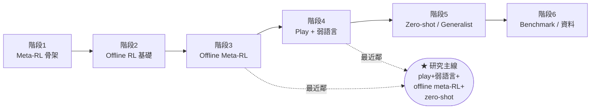

# 📚 論文閱讀 MOC（Map of Content）

> 這是整個 paper vault 的入口頁。28 篇論文逐段筆記按 [[read|read.md]] 的六階段排列。
> 研究主線視角請看 → [[研究主線地圖]]；可行方案決策 → [[research_direction_options|研究方向決策]]；研究 idea 萃取 → [[innovation_notes|創新筆記]]。

---

## 🗺️ 階段總覽

---

## 1️⃣ Meta-RL 骨架

先搞懂「meta-RL 到底在 meta 什麼」。

- [[MAML]] — 用 bilevel（inner 適應 / outer 學初始化）做快速適應；gradient-based，當 few-shot 上界對照。
- [[RL2]] — fast learner 塞進 RNN hidden state，forward-pass 即適應；forward-adaptation baseline 家族最樸素者。
- [[PEARL]] — off-policy meta-RL，probabilistic context `q(z|c)` 做 task inference + posterior sampling。**本專案重現主線。**
- [[VariBAD]] — 把 task belief 當 BAMDP 的 state，VAE 線上推論 belief、近似 Bayes-optimal 探索。**核心。**

## 2️⃣ Offline RL 基礎

先懂「為什麼離線學習這麼難」。

- [[OfflineRL_Survey|Offline RL 綜述]] — 問題框架與核心難點（distribution shift、extrapolation error、OOD action）。
- [[D4RL]] — offline RL 標準 benchmark；覆蓋/品質/stitching 屬性可做 robustness ablation。
- [[CQL]] — 保守 Q（壓 OOD action 得 lower bound）；policy backbone 候選，α 當保守度旋鈕。
- [[IQL]] — expectile + AWR，in-sample 不評估 OOD action；對弱標註/次優 data 友善的**推薦 backbone**。
- [[DecisionTransformer|Decision Transformer]] — RL 寫成 sequence modeling，return-to-go 當 prompt；T2DA-T 骨架。

## 3️⃣ Offline Meta-RL（理論主幹）

研究最可能落在這區。

- [[MACAW]] — offline meta-RL 起點之一（AWR + enriched policy update + bilevel）；baseline。
- [[OfflineMetaRL_OnlineSelfSupervision|Online Self-Supervision (SMAC)]] — 揭示 meta-test 收新 context 造成 z-space shift；嚴格 zero-shot 正好繞過。**警訊。**
- [[CORRO]] — 對比學習去除 behavior policy 對 task latent 的汙染；與語言 supervision 互補。
- [[CSRO]] — max-min MI 處理 context shift；**關鍵洞見：語言可當 policy-invariant task anchor。核心警訊。**
- [[InfoTheoretic_COMRL|UNICORN（資訊論框架）]] — 證明 FOCAL/CORRO/CSRO 都優化 `I(Z;M)` 不同界；可設計弱語言半監督 objective。
- [[T2DA]] — **最近鄰之一**：world model → dynamics-aware embedding → CLIP 式對齊語言 → zero-shot。**主要 baseline。**

## 4️⃣ Robot Play Data 與弱語言標註

題目最具機器人味的部分。

- [[LatentPlansFromPlay|Learning Latent Plans from Play]] — play 三特性 + hindsight relabel + latent plan 中介表示。
- [[LangConditioned_IL_Unstructured|LangLfP / MCIL]] — shared latent goal space 同吃 goal-image 與語言，1% 標註；但還不是 meta-RL。
- [[LangConditioned_Robot_Crowdsourced|LOReL]] — offline data + crowd-sourced 語言學 language-conditioned reward；非直接 text-to-action。
- [[FromPlayToPolicy|From Play to Policy (C-BeT)]] — 從 uncurated play 做 conditional behavior generation；強調 multi-modal 生成。
- [[PlayFusion]] — language-annotated play + diffusion + discrete skill bottleneck。
- [[LUMOS]] — **最近鄰之二**：play → world model → latent 空間 on-policy 練（DITTO reward）→ <1% 弱語言 CLIP 對齊 → zero-shot 真機。**主要 baseline。**

## 5️⃣ Zero-shot Task Specification 與 Generalist Policy

接到大模型與 generalist policy 趨勢。

- [[ZeroShot_TaskSpecification|Zero-Shot Task Specification (ZeST)]] — foundation model 把語言/圖/草圖轉成 task spec；強調 task spec ≠ task execution。
- [[RT1|RT-1]] — 大規模真機資料的 generalist policy。
- [[RT2|RT-2]] — VLA：action 當 text token，遷移 web 知識到 robot semantics。
- [[OpenX_Embodiment|Open X-Embodiment]] — 多機構多 embodiment 資料標準化，跨平台正遷移。
- [[Octo]] — 開源模組化 generalist policy，diffusion action head；**最適合當 backbone。**
- [[OpenVLA]] — 7B 開源 VLA，可 LoRA 微調當「弱語言→z」前端；當 baseline 非重訓。

## 6️⃣ Benchmark 與資料格式

做實驗前必補。

- [[CALVIN]] — **最契合 benchmark**：play + 只標 1% 語言 + 長時程 + 嚴格 zero-shot；MCIL baseline 5 連鏈僅 0.08%。**主要評估平台。**
- [[RLDS]] — RL 資料標準格式（episode/step/metadata）；接 Open X / robot trajectory 幾乎必經。

---

## 🏷️ 常用標籤

按角色快速過濾：`#核心` `#最近鄰` `#主要baseline` `#推薦backbone` `#核心警訊` `#可借用`
按主題：`#meta-rl` `#offline-rl` `#offline-meta-rl` `#play-data` `#zero-shot` `#CLIP對齊` `#world-model` `#benchmark`

## 📌 三個關鍵結論（詳見 [[研究主線地圖]]）

1. 核心機制已被 [[T2DA]] 與 [[LUMOS]] 雙重驗證可行（都用 CLIP 式把語言對齊到一個 latent）。
2. 最危險的敵人是 context 被 behavior policy 汙染（[[CSRO]] / [[CORRO]]）；語言當 policy-invariant anchor 是潛在理論貢獻。
3. 工程上站在巨人肩上：[[Octo]] backbone、[[CALVIN]] benchmark、[[RLDS]] 資料格式、[[IQL]]/[[DecisionTransformer|DT]] policy、baseline 打 [[T2DA]]+[[LUMOS]] 兩條線。
