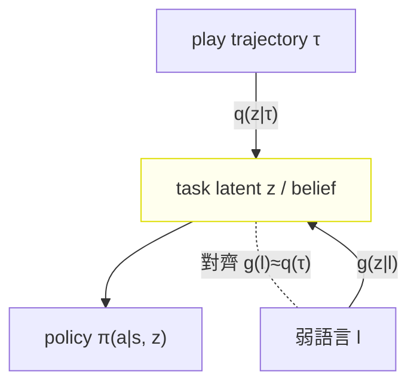
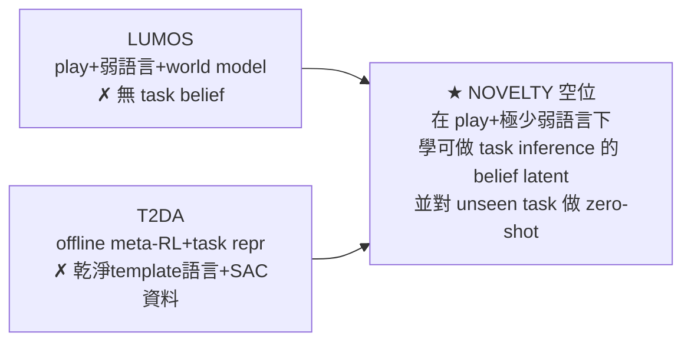

# 🎯 研究主線地圖

> 入口：[[MOC|論文 MOC]]｜決策文件：[[research_direction_options|研究方向決策]]｜idea 萃取：[[innovation_notes|創新筆記]]
>
> **使用者主線**：robot play data + 極少量弱語言標註 + offline meta-RL + 文字→task spec/embedding 做 zero-shot 任務泛化。並關注 meta-learning × zero-shot。

---

## 🧩 一句話定位

把 **meta-RL 的 task inference**（從互動軌跡推 task latent `q(z|τ)`）換成 **language inference**（從語言推同一 latent `g(z|l)`），讓兩者在同一 latent space 對齊，於是測試時**只給語言就能 zero-shot 指定任務**。

---

## 🗂️ 四塊主線 × 論文對應

### 塊 A — robot play data
- [[LatentPlansFromPlay|Learning Latent Plans from Play]]（play 三特性、latent plan）
- [[FromPlayToPolicy|C-BeT]]（uncurated play、multi-modal 生成）
- [[CALVIN]]（play + 1% 語言的 benchmark，**評估平台**）
- 相關難點：[[CORRO]]（play 由雜多 behavior 收集 → latent 易被 policy 汙染）

### 塊 B — 極少量弱語言標註
- [[LangConditioned_IL_Unstructured|LangLfP / MCIL]]（1% 語言 + shared latent goal）
- [[LangConditioned_Robot_Crowdsourced|LOReL]]（crowd-sourced 語言 → reward）
- [[PlayFusion]]（hindsight language-annotated play）
- [[LUMOS]]（<1% hindsight 弱語言 + CLIP 對齊，**最貼近使用者的弱語言設定**）

### 塊 C — offline meta-RL formalism
- [[MACAW]]、[[CORRO]]、[[CSRO]]、[[InfoTheoretic_COMRL|UNICORN]]（context-based offline meta-RL 主幹）
- [[OfflineMetaRL_OnlineSelfSupervision|SMAC]]（context shift 警訊）
- 基礎：[[OfflineRL_Survey|Offline RL 綜述]]、[[CQL]]、[[IQL]]、[[D4RL]]
- 理論根：[[PEARL]]、[[VariBAD]]（task latent / belief）

### 塊 D — 文字→task spec/embedding 的 zero-shot
- [[T2DA]]（**最近鄰之一**：CLIP 對齊 → zero-shot text-to-decision）
- [[LUMOS]]（**最近鄰之二**：CLIP 對齊語言↔world model latent → zero-shot 真機）
- [[ZeroShot_TaskSpecification|ZeST]]（task spec ≠ execution 的概念框架）
- [[DecisionTransformer|DT]]（語言當 condition token 的 policy 骨架）

---

## 🚀 backbone / baseline / 工程零件

| 用途 | 採用 |
| --- | --- |
| Backbone | [[Octo]]（開源模組化，可省 6–7 成工程）；[[OpenVLA]]（LoRA 當「弱語言→z」前端） |
| Policy 演算法 | [[IQL]]（推薦，對弱標註友善）、[[DecisionTransformer|DT]]、[[CQL]] |
| 主要 baseline | [[T2DA]]（meta-RL 線）+ [[LUMOS]]/HULC（play+語言線）**兩條都要打** |
| Benchmark | [[CALVIN]]（最契合） |
| 資料格式 | [[RLDS]]、[[OpenX_Embodiment|Open X-Embodiment]] |
| 可借用機制 | [[LUMOS]] 的 DITTO latent-matching reward（offline 也能 on-policy 練）、[[CORRO]] 對比去汙染、[[VariBAD]] belief |

---

## 🕳️ Novelty 空位（兩個近鄰的交集之外）

- [[LUMOS]] 有 play + 弱語言 + world model，但**無 offline meta-RL 的 task belief、無 unseen-task 泛化**。
- [[T2DA]] 有 offline meta-RL + task representation，但用**乾淨 template 語言 + SAC 資料**。
- **交集空位** = 在 play + 極少弱語言下，學一個能做 task inference 的 belief latent，並對 **unseen task**（而非只 unseen instruction）做 zero-shot。

---

## ⚠️ 三個關鍵警訊

1. **對齊穩定性是成敗關鍵** — [[LUMOS]] 的 No alignment 消融會操作錯顏色；弱語言對齊不準整個 zero-shot 會垮。
2. **context 被 behavior policy 汙染** — [[CSRO]] / [[CORRO]] 的核心；語言當 policy-invariant anchor 可能比對抗式 min-MI 更乾淨（潛在理論貢獻）。
3. **不能把近鄰已做的當賣點** — [[LUMOS]] 已做到 play+弱語言+zero-shot 語言操控；賣點必須是它沒有的 task belief / unseen-task 泛化，否則被視為增量。
