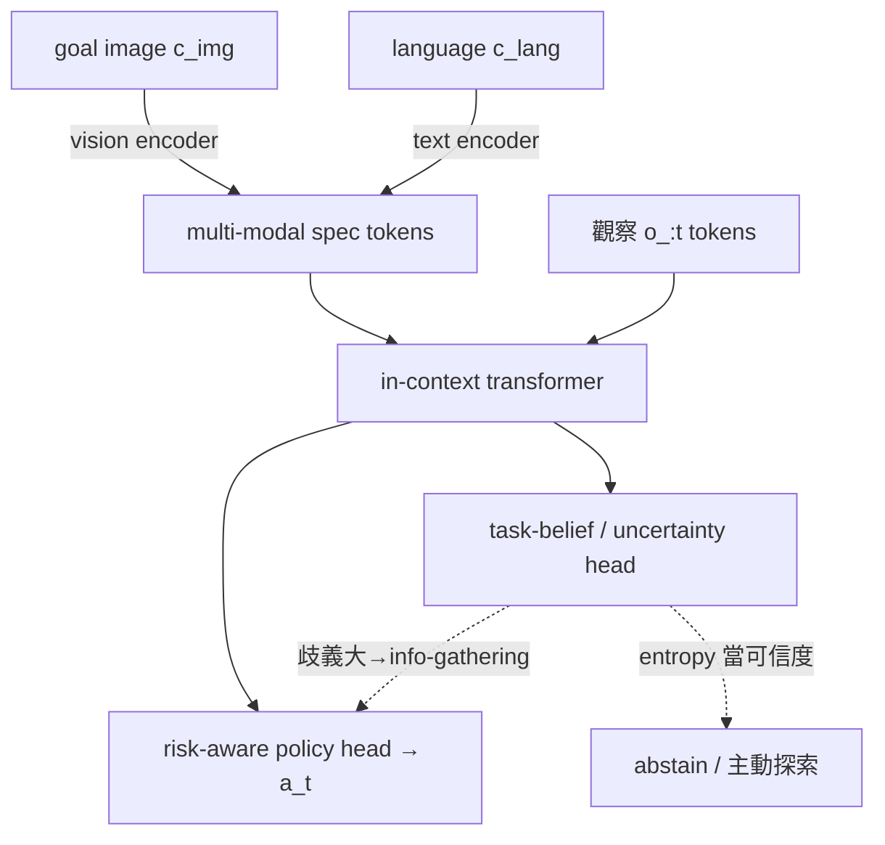

# Zero-Shot 創新提案：多模態歧義規格下的任務信念

> 相關：[[MOC|論文 MOC]]｜[[研究主線地圖]]｜[[research_direction_options|研究方向決策]]｜近鄰：[[T2DA]]、[[LUMOS]]、[[ZeroShot_TaskSpecification|ZeST]]
> 狀態：方向已定（多模態規格 + belief），技術底座待選（本文做三方比較）。
> 目標：conference，要求明確創新、不抄襲。

---

## 0. 一句話定位（the pitch）

> **現有 zero-shot 任務規格方法（語言或圖片）都假設「規格 → 一個確定的任務」，把規格壓成單一 task embedding 後盲目執行。我們主張：歧義的規格應該映成「任務的後驗信念（belief over tasks）」，policy 對整個信念做 risk-aware 行為，並在 inference time 用觀察把信念收斂——全程 zero-shot（無 gradient、無 target demo）。**

關鍵字：multi-modal task specification、ambiguity、posterior belief over tasks、risk-aware zero-shot、inference-time belief refinement。

---

## 1. 為什麼這是真創新（不是 T2DA/LUMOS 增量）

### 1.1 現有 zero-shot 方法的共同盲點

| 盲點 | T2DA | LUMOS | BC-Z / ZeST | 我們的解法 |
| --- | --- | --- | --- | --- |
| 規格壓成**單一點** embedding | ✗ ψ(l) 單點 | ✗ 單 goal embedding | ✗ | **後驗分布** b(z\|spec) |
| 規格**歧義**未建模 | ✗ template 語言假設無歧義 | ✗ | ✗ | 歧義→belief 變寬→自動 info-gathering |
| zero-shot 無**可信度** | ✗ 一律輸出 action | ✗ | ✗ | belief entropy 當對齊可信度 |
| **圖片**規格的歧義（比語言更模糊）| 未處理 | 未處理 | 部分（ZeST 指出但未解）| 核心處理對象 |
| 跨模態規格的**歧義程度差異** | 單模態 | 單模態 | 單模態 | 圖/語言歧義度不同→fusion 權重 |

**核心論點**：T2DA、LUMOS 都用 CLIP 式把規格對齊到「一個 latent」，再確定式地 condition policy。它們驗證了「規格→latent→zero-shot」可行，但**從沒處理「規格本身可能對應多個任務」**。這個缺口在**圖片規格**上尤其明顯：一張「杯子在桌上」的 goal image 沒講要不要管其他物件、要多精確、用哪隻手——它天生對應一個任務分布，不是一個任務。

### 1.2 為什麼「圖片+語言多模態」讓創新更站得住

- 圖片與語言的**歧義來源不同**：語言抽象但有明確 token（"red block"）；圖片具體但有未言明的細節（背景物件、精度）。兩者互補。
- 我們可以做一件沒人做過的事：**依模態的歧義程度動態調整 fusion**——語言明確時信語言、圖片明確時信圖片、兩者都模糊時 belief 變寬並探索。這是一個乾淨的、可量化的新機制。
- ZeST 已經點出「task specification ≠ execution、goal image 不一定是好介面」，但它停在「foundation model 能不能轉換」，**沒有 belief、沒有 meta-RL**。我們正好接著做。

### 1.3 與「meta-learning × zero-shot」的關係

這正是你一直關注的交集的最強形式：**meta-learning 提供「task latent + 對 belief 行動」的結構；zero-shot 是「測試時用規格（而非互動）產生 belief 的 prior，再用觀察收斂」**。規格 = prior，觀察 = likelihood，Bayesian fusion = 推論——這個 framing 是新的。

---

## 2. 問題形式化（modality-agnostic）

任務分布 `M ~ p(M)`，每個任務有一個隱 task 變數 `z`。訓練時每個任務配一個或多個**規格** `c`（可為 image `c_img`、language `c_lang`、或兩者），但**規格是歧義的**：`p(z | c)` 不是 delta，而是一個分布。

- **規格編碼器** `b(z | c)`：把規格映成 task 後驗信念（分布，非點）。多模態時 `b(z | c_img, c_lang)` 做融合。
- **觀察更新**：測試時 agent 與環境互動，用觀察 `o_{:t}` 做 inference-time 更新 `b(z | c, o_{:t})`——**純前向，無 gradient**，仍是嚴格 zero-shot。
- **risk-aware policy** `π(a | s, b)`：對整個 belief 行動（不是對單一 sample）。belief 寬 → 採 information-gathering / 保守行為；belief 收斂 → 果斷執行。

**嚴格 zero-shot 定義**（守住，避免 reviewer 攻擊）：測試任務無 target demonstration、無 gradient update、無針對新任務的額外訓練。允許的只有「給規格 + 測試時的環境觀察前向更新 belief」。

---

## 3. 三種技術底座比較（你要選的核心決定）

我們的「belief」可以用三種機制實現。三者都能做,差別在表達力、現代性、實作成本、創新空間。

### 底座 1：VariBAD-style Bayes-adaptive（RNN/VAE belief）

- **做法**：規格當 prior `b_0 = b(z|c)`，RNN 編碼觀察做 amortized posterior `b(z|c, o_{:t})`，policy 對 belief 行動（近似 Bayes-optimal）。
- **優**：理論最乾淨（BAMDP 框架現成）、belief 概念最直接、與 risk-aware 行為天然契合。
- **劣**：RNN belief 是 2020 技術，reviewer 可能覺得不夠新；高斯 belief 難表達多峰歧義。
- **創新空間**：把「規格當 prior、觀察當 likelihood 的跨模態 Bayesian fusion」接上 BAMDP——這層是新的，但底座本身舊。
- **實作成本**：低（VariBAD 有開源，你已精讀）。

### 底座 2：In-Context RL（transformer，AD / DPT 路線）⭐ 最現代

- **做法**：transformer 把「規格 token（image patch + language token）+ 歷史觀察 token」一起吃,在 context 裡做 task inference，autoregressive 出 action。belief 不顯式建模,而是隱含在 attention/context。
- **優**：**最現代**（2023-2025 正熱）、最能當賣點、context 天然容納多模態規格 + 觀察、純前向 in-context adaptation = 天生 zero-shot。可接 pretrained vision/language encoder。
- **劣**：「belief」是隱式的,要額外設計才能取出「可信度 / 歧義度」訊號（但這反而是你的創新點：**在 in-context RL 上顯式化 task uncertainty**——目前很空）。
- **創新空間**：**最大**。「multi-modal ambiguous spec 進 in-context RL + 顯式 uncertainty/risk head」是新題目。
- **實作成本**：中（要訓 transformer,但有 AD/DPT 參考實作）。

### 底座 3：Diffusion task/behavior 表示（T2DA-D / Decision Diffuser 路線）

- **做法**：用 diffusion 表示「任務後驗」或「多模態行為分布」,規格當 condition。歧義規格 → 多峰 diffusion 樣本。
- **優**：**最能表達歧義的多峰性**（一個規格對應多種任務/行為,diffusion 天生多模態）；與 T2DA-D 同架構好對比。
- **劣**：belief 的「uncertainty 量化」較間接（要從樣本變異估）；推論較慢。
- **創新空間**：大。「用 diffusion 表示 ambiguous-spec 的 task 後驗 + 從樣本散度估規格可信度」是新的。
- **實作成本**：中高（diffusion 訓練與調參較重）。

### 我的推薦排序（供你拍板）

1. **底座 2（In-Context RL）** — 最現代、創新空間最大、最好過 ML 頂會 reviewer；風險是要把「belief/uncertainty」從隱式變顯式（但這正是賣點）。
2. **底座 1（VariBAD-style）** — 最快出 proof-of-concept、理論最乾淨,適合先驗證想法再升級;當第一篇的 baseline 或 stepping stone。
3. **底座 3（Diffusion）** — 表達力最強,適合主打「歧義的多峰性」,但實作最重。

**可能的最強組合**：用**底座 2 當主方法**（in-context RL + 顯式 task-uncertainty head），用**底座 1 當理論動機與簡化 baseline**,用 diffusion 當 ablation 對照。

---

## 4. 方法草圖（以底座 2 為主的版本）

四個元件：
1. **多模態規格編碼**：image patch tokens（用 pretrained ViT/DINOv2）+ language tokens（用 pretrained text encoder），投到共同 token 空間。
2. **In-context 任務推論**：transformer 吃「規格 tokens + 歷史 (o,a) tokens」,在 context 裡推任務。
3. **顯式 task-uncertainty head**（創新點）：輸出 belief 的不確定性 / 規格可信度（可用 ensemble、evidential、或預測 task descriptor 的 entropy）。
4. **risk-aware policy head**：依不確定性調整行為——高不確定 → 先做 information-gathering 動作收斂 belief;低 → 果斷執行。

**訓練**：在多任務 offline/sim 資料上,模擬「歧義規格」（同一任務給多種規格、或一個模糊規格對應多任務）,讓模型學會「規格越模糊 → 越該先探索」。

**測試（zero-shot）**：給 unseen 規格（新組合 / 新講法 / 新 goal image）→ 前向產生 belief → risk-aware 行動,過程用觀察前向收斂 belief,**不更新任何權重**。

---

## 5. 實驗設計（多模態 + 可過 reviewer）

### Benchmark
- **CALVIN**（主）：天然 play + 1% 語言 + 長時程 + 嚴格 zero-shot;可同時給 **goal image 與 language** 當規格（CALVIN 兩者都有）。最契合多模態規格。
- **Meta-World / MuJoCo**（輔）：與 T2DA 同benchmark,方便直接對比 baseline。
- 可選 **真機**（若投 CoRL/RSS）。

### 三組核心實驗（對應三個賣點）
1. **歧義規格下的 zero-shot 表現**：對比 T2DA、LUMOS、BC-Z——在「規格刻意做模糊」的設定下,我們的 belief + risk-aware 是否勝出。
2. **多模態 fusion 的價值**：image-only / language-only / 我們的歧義感知 fusion 三者比較,證明「依歧義度動態融合」有效。
3. **可信度校準**：belief entropy 是否能預測 zero-shot 成功率（calibration plot）;OOD 規格時能否 abstain。

### 關鍵 ablation
- belief vs 單點（拔掉分布 → 退化成 T2DA 式）。
- 有無 inference-time 觀察更新。
- 有無 risk-aware（拔掉 → 盲目執行 belief mean）。
- 三底座對照（in-context vs VariBAD-style vs diffusion）。

---

## 6. Novelty 一句話（投稿時的 contribution bullets 雛形）

1. 首次把「歧義的多模態任務規格」形式化為**任務後驗信念**,而非單一 embedding。
2. 提出**歧義感知的跨模態 fusion**（規格當 prior、觀察當 likelihood 的 inference-time Bayesian 更新,全程 zero-shot）。
3. 在現代 in-context RL 上**顯式化 task uncertainty**,驅動 risk-aware zero-shot 行為與可信度校準。
4. 在 CALVIN / Meta-World 上,於**歧義規格**設定勝過 T2DA / LUMOS / BC-Z,並提供 zero-shot 可信度校準。

---

## 7. Reviewer 會問的硬問題（先想好答案）

| 質疑 | 預備回應 |
| --- | --- |
| 「這不就是 VariBAD + 語言/圖片?」 | VariBAD 無規格、無多模態、無歧義建模、無 risk-aware 的可信度。我們的 belief 是「從歧義規格推論」,且底座可現代化（in-context）。 |
| 「這不就是 T2DA/LUMOS 加 uncertainty?」 | 它們是單點確定式執行;我們改變了問題定義（規格→分布）、新增 inference-time fusion 與 risk-aware,且主打圖片規格的歧義（它們沒碰）。 |
| 「zero-shot 是不是偷吃資料?」 | 嚴守定義：無 target demo、無 gradient、無新任務訓練;只用規格 + 測試觀察前向更新 belief。 |
| 「歧義是你自己造的嗎?」 | 用 CALVIN 自然的 goal-image 歧義 + 我們定義的「一規格對多任務」評估協定,並報告自然 vs 人造兩種。 |
| 「為何不直接用 LLM/VLM 拆任務?」 | 那是 symbolic planning,非 learned belief,無法量化不確定性、無 risk-aware,且對 OOD 規格脆弱。 |

---

## 8. 待辦（投稿前必做）

1. **related work 查證**（重要,避免撞題）：上 arXiv / OpenReview 搜 2024-2025 的「uncertainty-aware in-context RL」「ambiguous goal specification」「multimodal task inference robot」「Bayesian in-context RL」,確認沒有人已做「歧義多模態規格 → task belief」。
2. **拍板技術底座**（in-context / VariBAD-style / diffusion / 組合）。
3. 定義「歧義規格」的評估協定（一規格對多任務、跨模態歧義度）。
4. 把方法展開成正式 problem statement + 演算法 + loss。
5. 跑 CALVIN 上的 proof-of-concept（先 in-context 或 VariBAD-style 擇一最快者）。

---

## 9. 一句話總結

把 zero-shot 任務規格從「規格→一個任務」升級成「歧義規格→任務後驗信念」,用現代 in-context RL 顯式化不確定性、做 risk-aware 行為,並在圖片+語言多模態下依歧義度融合——這個問題定義本身就跳出 T2DA/LUMOS 的單點確定式框架,也不再被 VariBAD 的舊底座綁住,是一個有明確 novelty、可過 conference 的方向。
